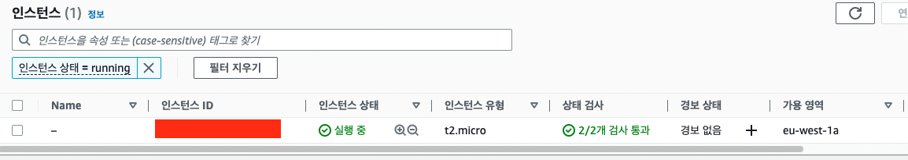
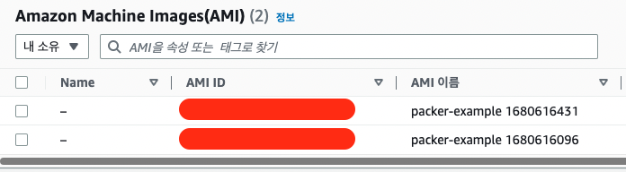

## Packer
템플릿을 기반으로 AWS AMI를 구축할 수 있게 도와주는 CLI 도구  
기본 이미지에 SW를 설치하는 방식이 아닌 SW가 이미 설치 된 골든 이미지 등을 활용하는 방식

### Packer 템플릿 예시
```json
{
    "variables": {
        "aws_access_key": "",
        "aws_secret_key": ""
    },
    "builders": [{
        "type": "amazon-ebs",
        "access_key": "{{user `aws_access_key`}}",
        "secret_key": "{{user `aws_secret_key`}}",
        "region": "us-east-1",
        "source_ami": "ami-fce3c696",
        "instance_type": "t2.micro",
        "ssh_username": "ubuntu",
        "ami_name": "packer-example {{timestamp}}"
    }],
    "provisioners": [{
        "type": "shell",
        "scripts": [ "scripts/install_software.sh" ],
        "execute_command": "{{ .Vars }} sudo -E sh '{{ .Path }}'",
        "pause_before": "10s"
    }]
}
```

### Packer를 이용한 Terraform DevOps
1. 앱 저장소로부터 앱을 클로닝 후 패커를 통해 AMI로 빌드
2. 테라폼을 통해 빌드한 AMI를 apply
3. 동시에 S3 버킷 등을 통해 테라폼 원격 상태 관리

#### 1. 패커 빌드
패커를 통해 빌드하면 다음과 같이 실행되는 스크립트의 응답 결과를 출력한다.
```bash
packer build -machine-readable packer-example.json

1680616098,,ui,say,==> amazon-ebs: Prevalidating any provided VPC information
1680616098,,ui,say,==> amazon-ebs: Prevalidating AMI Name: packer-example 1680616096
1680616101,,ui,message,    amazon-ebs: Found Image ID: ami-844e0bf7 # 기본 AMI는 요기에 존재
1680616101,,ui,say,==> amazon-ebs: Creating temporary keypair: packer_PACKER_ID
1680616102,,ui,say,==> amazon-ebs: Creating temporary security group for this instance: packer_PACKER_ID
1680616105,,ui,say,==> amazon-ebs: Authorizing access to port 22 from [0.0.0.0/0] in the temporary security groups...
1680616107,,ui,say,==> amazon-ebs: Launching a source AWS instance...
1680616109,,ui,message,    amazon-ebs: Instance ID: i-0d2b75ddf5773ad94
1680616109,,ui,say,==> amazon-ebs: Waiting for instance (i-0d2b75ddf5773ad94) to become ready...
1680616144,,ui,say,==> amazon-ebs: Using SSH communicator to connect: SSH_IP
1680616144,,ui,say,==> amazon-ebs: Waiting for SSH to become available...
1680616148,,ui,say,==> amazon-ebs: Connected to SSH!
1680616148,,ui,say,==> amazon-ebs: Pausing 10s before the next provisioner...
1680616158,,ui,say,==> amazon-ebs: Provisioning with shell script: scripts/install_software.sh
1680616161,,ui,message,    amazon-ebs: Hit:1 http://eu-west-1.ec2.archive.ubuntu.com/ubuntu xenial InRelease
1680616161,,ui,message,    amazon-ebs: Get:2 http://eu-west-1.ec2.archive.ubuntu.com/ubuntu xenial-updates InRelease [99.8 kB]
1680616161,,ui,message,    amazon-ebs: Get:3 http://eu-west-1.ec2.archive.ubuntu.com/ubuntu xenial-backports InRelease [97.4 kB]
1680616161,,ui,message,    amazon-ebs: Get:4 http://security.ubuntu.com/ubuntu xenial-security InRelease [99.8 kB]
1680616161,,ui,message,    amazon-ebs: Get:5 http://eu-west-1.ec2.archive.ubuntu.com/ubuntu xenial/main Sources [868 kB]
```

#### 2. 패커 빌드 후 AMI ID 파싱
`packer`를 활용해서 이미지를 빌드했을 때의 출력에서 AMI ID를 `awk`를 통해 파싱한다.
해당 AMI를 활용해서 테라폼의 `AMI_ID` 변수를 지정한다.

```bash
ARTIFACT=`packer build -machine-readable packer-example.json |awk -F, '$0 ~/artifact,0,id/ {print $6}'`
AMI_ID=`echo $ARTIFACT | cut -d ':' -f2`
echo 'variable "AMI_ID" { default = "'${AMI_ID}'" }' > amivar.tf
```

```go
variable "AMI_ID" { default = "ami-xxxxxxxxxxx" }
```

#### 3. 파싱한 AMI ID를 바탕으로 인스턴스 프로비저닝

